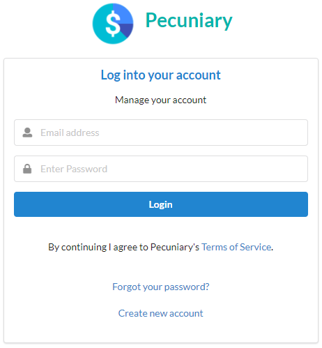
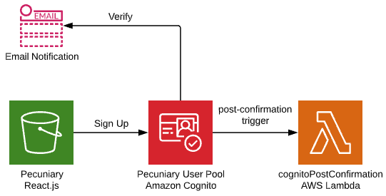
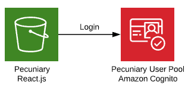
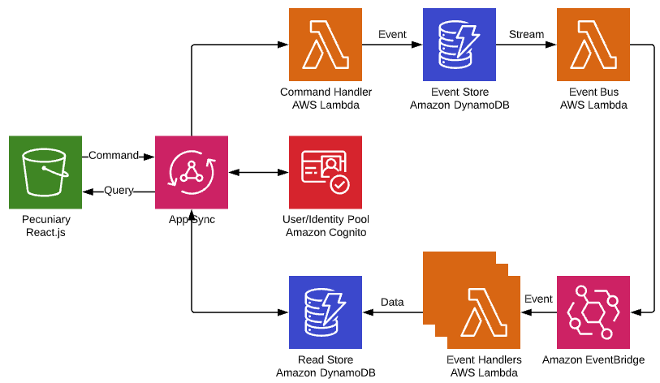
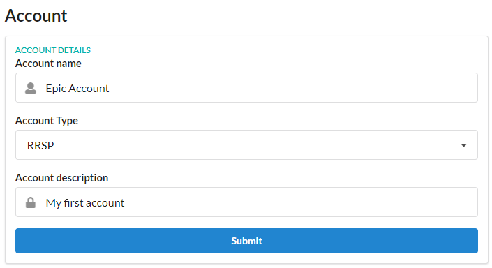
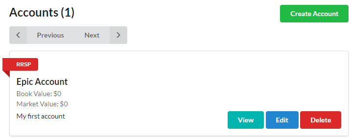
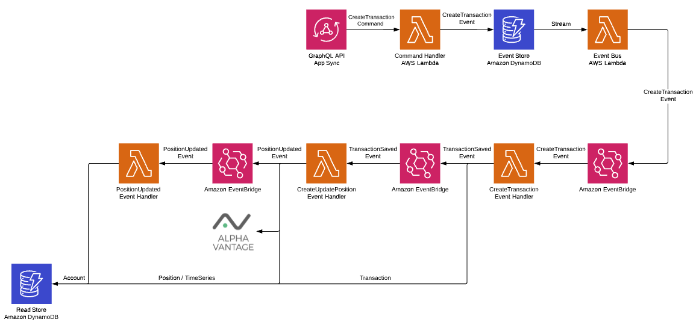
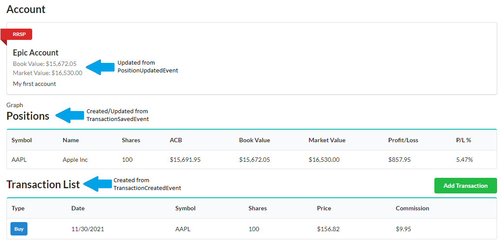

<h1 align="center">

  <p align="center">
    
    Pecuniary
  </p>
</h1>

# Architecture overview

Pecuniary is an event-driven serverless microservices application built with <a href="https://nodejs.org">Node.js</a>. The application uses Event Sourcing and CQRS in the backend with a ReactJS frontend.

This diagram represents how each of the pieces of the application interface with each other. The design of each individual component within this architecture is desribed below _(more will be added as the project progresses)_.

For an listing of the technologies used please see <a href="#technology-stack">Technology stack</a>.


# Detailed architecture

- <a href='#user-authentication-with-aws-cognito'>User authentication with AWS Cognito</a>
- <a href='#protecting-routes-in-react-router'>Protecting routes in React Router</a>
- <a href='#handling-events'>Handing events</a>
  - <a href='#example-creating-an-account'>Example: creating an Account</a>
- <a href='#event-bus-error-handling'>Event Bus error handling</a>

## User authentication with AWS Cognito

Authentication is managed with AWS Cognito User Pools within the React client. In the AWS Cognito User Pool, a Users group is created that each user that signs up is added to using a Cognito post-confirmation trigger.



### Sign up

For the sign up process, the `amazon-cognito-identity-js` package is used to create users in the AWS Cognito User Pool. Once the user is created, a verify email is sent for the user to confirm their email address. When the email address is confirmed, a Cognito post-confirmation trigger executes an [AWS lambda function](https://github.com/eric-bach/pecuniary/blob/main/backend/lib/lambda/cognitoPostConfirmation/main.ts) that adds the confirmed user to the appropriate `Pecuniary Users` group.



### Login

Login uses the authenticateUser() hook from the `amazon-cognito-identity-js` package to authentication the user in the AWS Cognito User Pool. If the user is successfully authenticated they will be directed to the `/home` route.



## Protecting routes in React Router

Protecting unauthenticate users from accessing parts of the application is necessary to keep the application secure. This is managed by using a custom component alongside the [React Router configuration](https://github.com/eric-bach/pecuniary/blob/main/client/src/App.tsx#L28)

The [ProtectedRoute](https://github.com/eric-bach/pecuniary/blob/main/client/src/components/ProtectedRoute.tsx) component checks the `localStorage` to determine if a user is authenticated before rendering the requested component. If the user is not authenticated, this component redirects to the `/login` page.

## Handling events

The Pecuniary application is entirely event driven with multiple `AWS Lambda` functions subscribing to events published to the `AWS EventBridge` event bus. The events first start out as commands from the client as `GraphQL API requests`.

A command handler becomes the resolver for all the `AWS AppSync` GraphQL API requests and validates and transforms the commands into events for the `EventStore` in `DynamoDB`. Using `AWS DynamoDB Streams` the events are processed by the `AWS Lambda` event bus that publishes the events on `AWS EventBridge` (as at this time EventBridge cannot directly process from a DynamoDB stream).

Multiple event handlers subscribing to the `AWS EventBridge` event bus process and denormalize data before making it to the Read Store which ultimately serves as the data for the `AWS AppSync` GraphQL queries requested by the React client. Since the data is already de-normalized, the queries are processed very quickly.



## Example: creating an Account

A user will fill out the Account form and click `Submit` to create a new Account:



When creating an Account, the `AWS Lambda` CommandHandler function resolves the `AWS AppSync` GraphQL API mutation request. The event data from the GraphQL API request is saved as an event in the EventStore:

```
{
    "aggregateId": "d22cdab6-bb53-42e4-b8ba-44289540d1ec",
    "name": "AccountCreatedEvent",
    "version": 1,
    "data": {
        "name": "Epic Account",
        "description": "My first account",
        "bookValue": 0,
        "marketValue": 0,
        "accountType": {
            "id": "2",
            "name": "RRSP",
            "description": "Registered Retirement Savings Account"
        }
    },
    "userId": "epicuser",
    "createdAt": "2021-10-30T19:36:27.077Z"
}
```

Upon saving this event in the `DynamoDB` event table, a `DynamoDB Stream` is processed by the `AWS Lambda` EventBus function and published to the `AWS EventBridge` event bus:

```
{
    "Source": "custom.pecuniary",
    "EventBusName": "pecuniary-bus",
    "DetailType": "AccountCreatedEvent",
    "Detail": {
        "aggregateId": "d22cdab6-bb53-42e4-b8ba-44289540d1ec",
        "eventName": "AccountCreatedEvent",
        "version": "1",
        "userId": "epicuser",
        "data": {
            "name": "Epic Account",
            "description": "My first account",
            "bookValue": 0,
            "marketValue": 0,
            "accountType": {
                "id": "2",
                "name": "RRSP",
                "description": "Registered Retirement Savings Account"
            }
        }
    }
}
```

These EventBridge events are subscribed to by various event handler `AWS Lambda` functions that will process the data and update the ReadStore with de-normalized data. This is how the created Account will look like in the `DynamoDB` ReadStore.

```
{
  "id": {
    "S": "40f496f6-8a49-4a30-8dac-99627682968d"
  },
  "version": {
    "S": "1"
  },
  "aggregateId": {
    "S": "6d274d22-78d3-4545-bd03-9deb448e6b2a"
  },
  "accountType": {
    "M": {
      "name": {
        "S": "RRSP"
      },
      "description": {
        "S": "Registered Retirement Savings Account"
      },
      "id": {
        "S": "2"
      }
    }
  },
  "bookValue": {
    "N": "0"
  },
  "userId": {
    "S": "epicuser"
  },
  "updatedAt": {
    "S": "2021-10-27T22:18:28.980Z"
  },
  "createdAt": {
    "S": "2021-10-27T22:18:28.980Z"
  },
  "marketValue": {
    "N": "0"
  },
  "description": {
    "S": "asdasd"
  },
  "name": {
    "S": "asdasd"
  }
}
```

The newly created Account then appears on the `/accounts` page.



## Example: creating a Transaction

When a Transaction is added to an Account, a number of events occur to ensure the entire domain is updated properly. These are handled by asynchronous event handlers through each stage of the event flow:



- the Transaction needs to be created in the read model
- a Position representing the total asset owned needs to be created/updated (if exists) and the market data representing the TimeSeries is retrieved for the symbol
- the Account market and book values are updated

When a Transaction is created the Account view looks like the following. A series of events are processed to update each domain of the read model.



In the above diagram when the `CreateTransactionEvent` is handled by the CreateTransaction event handler to de-normalize the transaction data to the read store. The event handler then publishes a `TransactionSavedEvent` to allow the Position/TimeSeries to be created/updated.

The CreateUpdatePosition event handler processes the `TransactionSavedEvent` by performing several operations to update the Position and TimeSeries read models.

- First it will retrieve market data for the Symbol in the Transaction through the`Yahoo Finance` APIs. This gets saved as TimeSeries data in the read model.
- Then it must create or update a Position representing the total asset owned for the symbol in the Transaction, updating the book and market value in the process.
- Finally the event handler publishes a `PositionUpdatedEvent` to allow for the Account market and book value to be re-calculated and updated.

Once the `PositionUpdatedEvent` handler is published, the PositionUpdated event handler updates the book and market value for the Account based on the TimeSeries data retrieved from the previous event handler. All of this data is updated in the Account read store.

## Event Bus error handling

The Pecuniary event bus has a DLQ that holds failed events from the DynamoDB event stream. A CloudWatch Alarm is configured to monitor for any messages (metric: NumberOfMessagesSent) and publishes to a SNS queue which has an email subscription.

# Technology stack

## Backend

- AWS CDK
- AWS Cognito User Pool
- AWS AppSync GraphQL
- AWS DynamoDB (EventStore, ReadStore)
- AWS DynamoDB Streams
- AWS EventBridge
- AWS SNS
- AWS SQS
- AWS Lambda
- AWS CloudWatch Events

## Frontend

- AWS CloudFront
- AWS Route 53
- React.js
- React Router
- Formik
- Yup
- Semantic UI React
- Zustand
- Cypress
