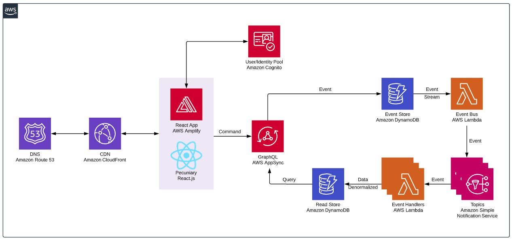

<h1 align="center">
  <p align="center">
    
    Pecuniary
  </p>
</h1>

<p align="center">
  <a href="diagrams">Diagrams</a> |
  <a href="#">Changelog</a> |
  <a href="#">Roadmap</a>
</p>

<h3 align="center">
  Built with event sourcing and CQRS
</h3>

<p align="center">
  An event-driven serverless microservices application built with <a href="https://github.com/aws/aws-amplify">aws-amplify</a> and <a href="https://nodejs.org">Node.js</a>
</p>

<p align="center">
  <a href="https://gitter.im/pecuniary/community">
    
  </a>
  <a href="https://www.codefactor.io/repository/github/eric-bach/pecuniary"></a>
  <a href="https://cypress.io">
    
  </a>
  <a href="https://github.com/eric-bach/pecuniary/blob/master/LICENSE">
    
  </a>
</p>

## Architecture

- `pecuniary-seed` populates the EventStore with default lookup values on each backend build through Amplify Console
- `pecuniary-eventBus` publishes Events to SNS topics. Subscribers to each SNS topic process the Event into the ReadStore



## Getting Started

1. Clone project and install dependencies

```bash
$ git clone https://github.com/eric-bach/pecuniary.git
$ cd pecuniary
$ npm install
```

2. Start the project

```bash
$ npm start
```

3. Run the app

```
http://localhost:3000/
```

## Environment Setup

1. Initialize AWS Amplify

```bash
$ amplify init
```

2. Deploy to AWS Account

```
amplify push
```

## License

This project is licensed under the terms of the [MIT license](/LICENSE).
