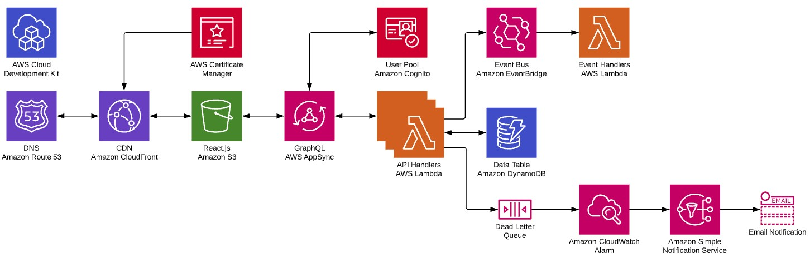

<h1 align="center">
  <p align="center">
    
    Pecuniary
  </p>
</h1>

[](https://github.com/eric-bach/pecuniary/actions/workflows/test.yml)
[](https://github.com/eric-bach/pecuniary/actions/workflows/deploy.yml)
[](https://www.codefactor.io/repository/github/eric-bach/pecuniary)
[](https://github.com/eric-bach/pecuniary/issues?q=is%3Aopen+is%3Aissue) [](https://github.com/eric-bach/pecuniary/issues?q=is%3Aissue+is%3Aclosed)
[](https://gitter.im/pecuniary/community) 

<p align="center">
  <a href="#getting-started">Getting Started</a> |
  <a href="ARCHITECTURE.md">Architecture</a> |
  <a href="#deployment">Development</a> |
  <a href="https://trello.com/b/7lA2gwTs/pecuniary">Trello</a> |
  <a href="#project-resources">Resources</a>
</p>

<p align="center">
  An <strong>event-driven serverless microservices</strong> financial investment application built with <a href="https://nextjs.org">Next.js</a> and <a href="https://tailwindcss.com">Tailwind CSS</a> on <a href="https://aws.amazon.com">Amazon Web Services</a>
</p>

## Architecture



⚠️<strong>Note:</strong> the Event Sourcing and CQRS version is no longer maintained. Please see <a href="https://github.com/eric-bach/pecuniary/tree/cqrs-v1">branch</a> and <a href="https://github.com/eric-bach/pecuniary/blob/cqrs-v1/ARCHITECTURE.md">CQRS Architecture</a> for the last release.

## Getting Started

This quick start guide describes how to get the application running. An `AWS account` is required to deploy the infrastructure required for this project.

### Configure the app

1.  Clone the project

    ```bash
    $ git clone https://github.com/eric-bach/pecuniary.git
    ```

2.  Install dependencies for CDK

    ```bash
    $ cd ./infrastructure
    $ npm install
    ```

3.  Install dependencies for the rest of the application using the recursive-install script

    ```bash
    $ cd ./infrastructure
    $ npm cinstall-all
    ```

4.  Copy the `./frontend/.env.example` file to `./frontend/.env` and fill in the parameter values from the CDK stack outputs in step 2:

    ```
    CONVEX_DEPLOYMENT=
    VITE_CONVEX_URL=
    VITE_CONVEX_SITE_URL=
    VITE_COGNITO_USERPOOL_ID=
    VITE_COGNITO_CLIENT_ID=
    VITE_TURNSTILE_SITE_KEY=
    ```

## Deploy the app

1.  Follow the steps in [Deployment with CDK CLI](#deployment-with-cdk-cli)

## Running the app locally

1.  Start the frontend:

    ```bash
    $ cd frontend
    $ npm run dev
    ```

# Deployment

## Deployment with CDK CLI

The Pecuniary application consists of the CDK backend and React frontend, each of which has an independent method of deploying. The backend is deployed via CDK where the frontend is deployed via SST.

### Deploy backend via CDK script

1. Bootstrap CDK (one-time only)

   ```
   $ cdk bootstrap aws://{ACCOUNT_ID}/{REGION} --profile {PROFILE_NAME}}
   ```

2. Ensure AWS credentials are up to date. If using AWS SSO, authorize a set of temporary credentials

   ```bash
   aws sso login --profile PROFILE_NAME
   ```

3. Deploy the backend and frontend

   ```
   $ npm run deploy dev PROFILE_NAME
   ```

## Deployment via GitHub Actions

1. Create an AWS role that can be assumed by GitHub Actions and add it to the `AWS_SERVICE_ROLE_ARN` GitHub Secret.

   ```
   $ npm run deploy-cicd prod PROFILE_NAME
   ```

2. Create an API token for 'Edit Cloudflare Workers' in the [Cloudflare dashboard](https://dash.cloudflare.com/9bddf6419d27540278319132720bc972/api-tokens) and add it to the `CLOUDFLARE_API_TOKEN` GitHub Secret.

3. Add the following GitHub Secrets to the repository

   Common

   ```
   CLOUDFLARE_API_TOKEN - Cloudflare API token
   CLOUDFLARE_ACCOUNT_ID - Cloudflare account id
   VITE_TURNSTILE_SITE_KEY - Cloudflare Turnstile site key
   ```

   Dev environment

   ```
   AWS_SERVICE_ROLE_ARN - GitHub Actions Role ARN
   CONVEX_DEPLOYMENT - Convex deployment id
   CONVEX_DEPLOY_KEY - Convex deployment key
   VITE_CONVEX_URL - Convex deployment url
   VITE_COGNITO_USERPOOL_ID - Cognito user pool id
   VITE_COGNITO_CLIENT_ID - Cognito client id
   ```

   Production environment

   ```
   AWS_SERVICE_ROLE_ARN - GitHub Actions Role ARN
   CONVEX_DEPLOYMENT - Convex deployment id
   CONVEX_DEPLOY_KEY - Convex deployment key
   VITE_CONVEX_URL - Convex deployment url
   VITE_COGNITO_USERPOOL_ID - Cognito user pool id
   VITE_COGNITO_CLIENT_ID - Cognito client id
   ```

# Event Sourcing and CQRS Architecture

For more detailed information about the event-driven nature of the Pecuniary application and it's architecture, please see the [Architecture.md](ARCHITECTURE.md)

# Projects References

Links to additional documentation specific to the Application

## AppSync

- [Saved GraphQL queries/mutations for GraphiQl](docs/GraphQL.md)
- [How to add a new GraphQL API/Command Handler](docs/CommandHandler.md)
- [How to call an authenticated AppSync GraphQL API with Apollo Client](docs/ApolloClient.md)

# Resources

Various links to additional articles/tutorials used to build this application.

## AppSync

- [How to build an authenticated GraphQL AppSync API with CDK](https://github.com/dabit3/build-an-authenticated-api-with-cdk)
- [How to perform a GraphQL Query with Apollo using React hooks](https://www.yannisspyrou.com/querying-app-sync-using-react-hooks)
- [How to perform a GraphQL Mutation with Apollo using React hooks](https://www.qualityology.com/tech/connect-to-existing-aws-appsync-api-from-a-react-application/)

## Cognito

- [How to add a protected route to React](https://dev.to/olumidesamuel_/implementing-protected-route-and-authentication-in-react-js-3cl4)
- [How to authenticate with Cognito using React hooks](https://github.com/DevAscend/YT-AWS-Cognito-React-Tutorials)
- [How to add a user to a Cognito User Group](https://bobbyhadz.com/blog/aws-cognito-add-user-to-group)

# License

This project is licensed under the terms of the [MIT license](/LICENSE).
